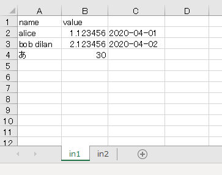
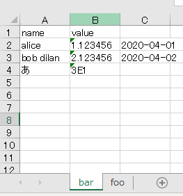

# convert-fileformat-with-pandas
Convert file format with [pandas](https://pandas.pydata.org/).

[](https://travis-ci.org/yuji38kwmt/convpandas)
[](https://badge.fury.io/py/convpandas)
[](https://pypi.org/project/convpandas/)

# Requirements
* Python 3.7+

# Install

```
$ pip install convpandas
```

https://pypi.org/project/convpandas/


# Usage

## csv2xlsx
Convert csv file to xlsx file.

```
$ convpandas csv2xlsx --help
usage: convpandas csv2xlsx [-h] [--sep SEP] [--encoding ENCODING] [--quotechar QUOTECHAR] [--numeric_to_string] [--sheet_name SHEET_NAME [SHEET_NAME ...]]
                           csv_files [csv_files ...] xlsx_file

positional arguments:
  csv_files

  xlsx_file

optional arguments:
  -h, --help            show this help message and exit

  --sep SEP             Delimiter to use when reading csv. (default: ,)

  --encoding ENCODING   Encoding to use when reading csv. List of Python standard encodings.
                        https://docs.python.org/3/library/codecs.html#standard-encodings (default: utf-8)

  --quotechar QUOTECHAR
                        The character used to denote the start and end of a quoted item when reading csv. (default: ")

  --numeric_to_string   If specified, write numeric value as string type. If not specified, write numeric value as numeric type. (default: False)

  --sheet_name SHEET_NAME [SHEET_NAME ...]
```


Convert `in.csv` to `out.xlsx` .

```
$ convpandas csv2xlsx in.csv out.xlsx
```


When `CSV_FILE` is `-` , STDIN is used for input. 

```
$ convpandas csv2xlsx - out.xlsx < in.csv
```

Convert `in1.csv` and `in2.csv` to `out.xlsx` . Sheet name is csv filename without its' suffix.  

```
$ convpandas csv2xlsx in1.csv in2.csv out.xlsx
```



If `--sheet_name` is specified, sheet name is set.

```
$ convpandas csv2xlsx in1.csv in2.csv out.xlsx --sheet_name foo bar
```



## xlsx2csv
Convert xlsx file to csv file.

```
$ convpandas xlsx2csv --help
usage: convpandas xlsx2csv [-h] [--sheet_name SHEET_NAME] [--sep SEP] [--encoding ENCODING] [--quotechar QUOTECHAR] xlsx_file csv_file

positional arguments:
  xlsx_file

  csv_file

optional arguments:
  -h, --help            show this help message and exit

  --sheet_name SHEET_NAME
                        Sheet name when reading xlsx. If not specified, read 1st sheet. (default: None)

  --sep SEP             Field delimiter for the output file. (default: ,)

  --encoding ENCODING   A string representing the encoding to use in the output file. (default: utf-8)

  --quotechar QUOTECHAR
                        Character used to quote fields. (default: ")
```


Convert `in.xlsx` to `out.csv` .

```
$ convpandas csv2xlsx in.xlsx out.csv
```


When `CSV_FILE` is `-` , write to STDOUT. 

```
$ convpandas csv2xlsx in.xlsx -
name,age
Alice,23
```

With specifying `--sheet_name`, you can select sheet name that you want to convert.

```
$ convpandas csv2xlsx in.xlsx out.csv --sheet_name sheet2
```
